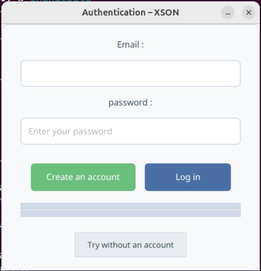
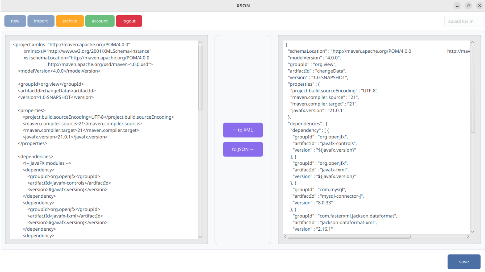
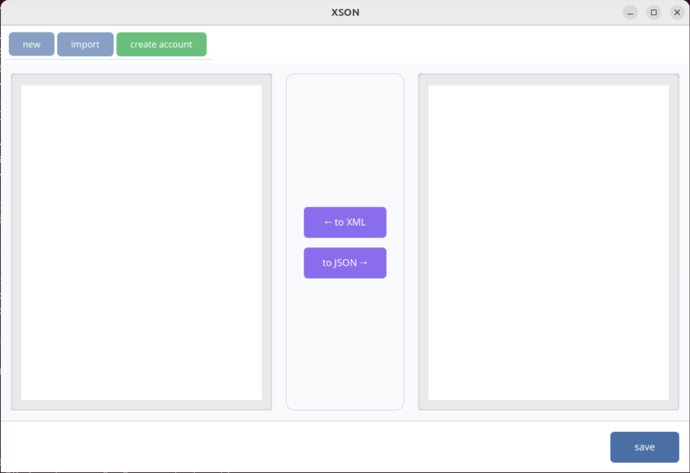
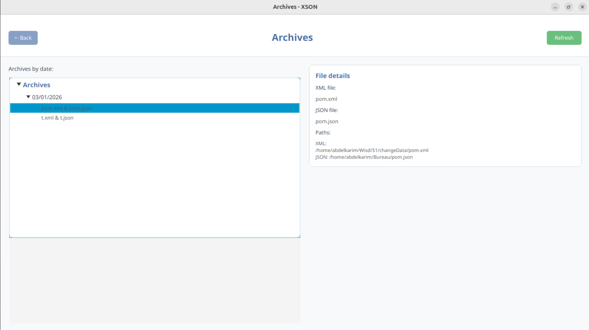

## README Translation
- [English](README_EN.md)

# XSON

**Module** : Echange de données et interopérabilité\
**Encadrant** : Prof. El Habib NFAOUI\
**Programme** : Master WISD 2025-2026

------------------------------------------------------------------------

## Description
XSON est une application JavaFX développée avec Maven pour la gestion de comptes utilisateurs, de fichiers et d'archives. L'application offre des fonctionnalités avancées de conversion bidirectionnelle entre formats JSON et XML, avec des implémentations utilisant des APIs externes (Jackson, org.json) et des implémentations personnalisées sans dépendances externes.

## Fonctionnalités Principales

### 🔄 Conversion JSON ↔ XML
L'application propose des utilitaires sophistiqués pour la conversion de données :

#### Avec API (Bibliothèques externes)
- **JsonToXml** : Utilise `org.json` et Jackson pour convertir JSON en XML avec formatage automatique et indentation
- **XmlToJson** : Utilise `Jackson XmlMapper` pour convertir XML en JSON avec pretty-printing

#### Sans API (Implémentation personnalisée)
- **JsonToXml** : Parser JSON manuel avec génération XML récursive et formatage
- **XmlToJson** : Parser XML DOM personnalisé avec conversion en structure JSON

### 👤 Gestion des Comptes et Utilisateurs
- Création et authentification des comptes
- Gestion des profils utilisateurs avec rôles (guest/admin)
- Sécurité avancée avec hachage BCrypt des mots de passe
- Validation des données utilisateurs

### 📁 Gestion des Fichiers et Archives
- Upload et stockage de fichiers XML/JSON
- Gestion automatique des paires de fichiers (JSON ↔ XML)
- Organisation en archives avec associations utilisateurs
- Recherche et filtrage par date de modification
- Métadonnées complètes des fichiers (nom, type, date)

### 🖥️ Interface Utilisateur JavaFX
- Dashboard principal avec éditeur double-panel (JSON/XML)
- Conversion en temps réel entre formats
- Gestion des archives et fichiers
- Interface intuitive avec thèmes personnalisés

## Screenshots

### 🔐 Écran de connexion


### 🖥️ Dashboard principal – Conversion JSON ↔ XML


### 👤 Dashboard invité (essai sans compte)


### 📁 Gestion des archives



## Technologies Utilisées
- **Java 21** - Langage de programmation
- **JavaFX 21** - Interface utilisateur
- **MySQL** - Base de données
- **Maven** - Gestion des dépendances
- **Jackson** - Sérialisation JSON/XML
- **org.json** - Manipulation JSON
- **Jakarta JSON** - API JSON standard
- **JDBC** - Connexion base de données

## Installation

### Prérequis
- Java 21 ou supérieur
- Maven 3.x
- MySQL Server

### Configuration de la Base de Données
1. Créez une base de données MySQL nommée `changeData`
2. Modifiez les paramètres de connexion dans `src/main/resources/application.properties` :
   ```properties
   db.driver=com.mysql.cj.jdbc.Driver
   db.url=jdbc:mysql://localhost:3306/changeData?useSSL=false&serverTimezone=UTC
   db.user=votre_utilisateur
   db.password=votre_mot_de_passe
   ```

### Installation et Exécution
1. Clonez le repository :
   ```bash
   git clone https://github.com/Kwimoad/XSON.git
   cd application
   ```

2. Compilez le projet :
   ```bash
   mvn clean compile
   ```

3. Exécutez l'application :
   ```bash
   mvn exec:java -Dexec.mainClass="Main"
   ```

## Utilisation

### Conversion JSON/XML
```java
// Avec API
import org.utils.withAPI.JsonToXml;
String xml = JsonToXml.convertJsonToXmlPretty(jsonString, "root");

// Sans API
import org.utils.withoutAPI.JsonToXml;
String xml = JsonToXml.convertJsonToXmlPretty(jsonString, "root");
```

### Interface Graphique
1. Lancez l'application
2. Connectez-vous ou créez un compte
3. Utilisez l'éditeur double-panel pour :
   - Saisir du JSON et convertir en XML
   - Saisir du XML et convertir en JSON
   - Sauvegarder les fichiers convertis
4. Gérez vos archives dans l'onglet dédié

## Architecture
```
src/main/java/org/
├── controller/      # Contrôleurs métier (File, Account, etc.)
├── dto/             # Objets de transfert de données (User, FileInformation, etc.)
├── Models/          # Repositories et accès aux données
├── service/         # Services métier (Authentication)
├── utils/           # Utilitaires de conversion et validation
│   ├── withAPI/     # Conversions avec bibliothèques externes
│   └── withoutAPI/  # Conversions personnalisées
├── views/           # Interfaces utilisateur JavaFX
│   ├── style/       # Styles et constantes UI
│   └── *.java
├── security/        # Sécurité et gestion des mots de passe (BCrypt)
├── database/        # Connexion et gestion de la base de données
├── resource/        # Ressources applicatives (ResourceDB)
└── Main.java        # Point d’entrée de l’application
```

## Vidéo Explicative
Pour une démonstration complète des fonctionnalités de conversion JSON/XML et de l'interface utilisateur, consultez notre vidéo explicative disponible sur Drive.

## Contributeurs
- Aouad Abdelkarim

## Licence
Ce projet est sous licence MIT. Voir le fichier LICENSE pour plus de détails.
